# 최종 보고서 HWP 삽입용 Markdown v8 (FINAL_HWP_INSERTION_REPORT_V8.md)

---

## 0. 표지 (Cover Page)

### **SW중심대학 기업연계 프로젝트 최종 결과보고서**

* **연구과제명 (국문)**: 회귀 기반 학령인구·학생수 감소압력 예측 및 적정규모학교 우선점검 시나리오 분석
* **연구과제명 (영문)**: Regression-Based School Enrollment Decline Pressure Forecasting and Scenario Analysis for School Sizing Optimization
* **연계교과목명**: [작성 필요]
* **지도교수**: [작성 필요] (교수명)
* **참여학생**: [작성 필요] (학생 연구원 명단 및 학번)
* **제출일자**: 2026년 6월 14일
* **제출처**: [작성 필요] 주관대학 SW중심대학사업단

---

## 1. 【서식 1】 SW중심대학 기업연계 프로젝트 결과보고서

### **SW중심대학 기업연계 프로젝트 결과보고서**

| 연구과제명 | (국문) 회귀 기반 학령인구·학생수 감소압력 예측 및 적정규모학교 우선점검 시나리오 분석 (영문) Regression-Based School Enrollment Decline Pressure Forecasting and Scenario Analysis for School Sizing Optimization |
| :--- | :--- |
| **연계교과목명** | [작성 필요] (예: 캡스톤디자인, 기계학습 등 관련 과목명) |
| **연구기간** | [작성 필요] (예: 2026.03.02 ~ 2026.06.14) |
| **연구비** | [작성 필요] (예: 금000,000원) |
| **지도교수** | 소속: [작성 필요] / 직급: [작성 필요] / 성명: [작성 필요] |
| **산업체 연구원** | 소속: [작성 필요] / 직급: [작성 필요] / 성명: [작성 필요] |
| **학생 연구원** | 대표학생 성명: [작성 필요] (학번: [작성 필요], 학과: [작성 필요], 연락처: [작성 필요]) 참여학생 성명: [작성 필요], [작성 필요] (각각 학번/학과/연락처 포함) |

본 프로젝트의 수행 결과를 담은 최종 결과보고서를 첨부 서류와 함께 제출합니다.

**첨부서류:**
1. 산학협력 프로젝트 결과보고서 요약 1부.
2. 연구 결과보고서 1부.

2026년 6월 14일

대표학생: [작성 필요] (서명/인)
지도교수: [작성 필요] (서명/인)

**[작성 필요] SW중심대학사업단장 귀하**

---

## 2. 【서식 2】 산학협력 프로젝트 결과보고서 요약

### **산학협력 프로젝트 결과보고서 요약**

#### **1. 프로젝트 개요**
* **프로젝트명**: 회귀 기반 학령인구·학생수 감소압력 예측 및 적정규모학교 우선점검 시나리오 분석
* **협력기관(국가)**: [작성 필요] (국내 연계 기업/기관명)
* **담당 교수**: [작성 필요]
* **수행기간**: [작성 필요]
* **소요예산**: [작성 필요] (합계 금액)
* **소요예산 세부내역**: [작성 필요] (재료비, 여비, 회의비 등 간략 기술)
* **참여인원**:
  - 지도교수: 1명
  - 산업체멘토: 1명
  - 학생 연구원: [작성 필요]명

#### **2. 추진 배경**
* 대한민국은 현재 심각한 저출산 기조와 학령인구 감소 직면.
* 비수도권 및 도서산간 지역을 중심으로 학령인구가 급격히 감소함에 따라 저학생수 학교가 증가하고 있으며, 이는 학급 운영난, 교육 인프라 유지비용 증가, 지역 간 교육 격차 심화로 이어짐.
* 기존의 적정규모학교 정책이나 학교 규모 조정 논의는 단순히 현재 학생 수와 정량적 행정 기준에만 의존하여 지리적 위치, 주변 대체 학교 부족에 따른 통학 편의성 등 공간적 맥락을 반영하지 못함.
* 기계학습 기반의 예측 시도는 행정적·정책적 판단 및 지역사회 반발 등 비정량적 외생 변수가 강하게 작용하는 희소 사건(Sparse Event)의 특성상 왜곡된 예측 결과를 낳기 쉬움.
* 따라서 본 프로젝트는 문제를 **"학교별 학생 수 감소압력 예측"** 및 **"지리적 고립도 연계 교육공백 우려 시각화"**로 재정의하여 교육 행정의 신뢰도 높은 의사결정 보조 도구를 제공하고자 함.

#### **3. 목표 및 내용**
* **목표**: 전국 학교 데이터를 통합한 패널 데이터셋을 기반으로 학교별 향후 5개년(2026~2030년)의 학생 수 감소압력을 안정적으로 예측하고, 고립도 지표를 결합하여 교육공백 우려 학교를 사전에 식별하는 웹 기반 시나리오 대시보드 시스템 구축. 본 프로젝트는 특정 학교를 행정적으로 결정하는 시스템이 아니라, 학생 수 감소압력과 지리적 고립도를 함께 제시하는 우선점검 참고 도구이다.
* **주요 내용**:
  - **데이터 통합**: 학교알리미 학교 기본 정보, 학급별/학년별 학생 수, SGG 단위 KOSIS 지역 인구 및 출생아 수, 순이동 지표, 학교 좌표 데이터 통합 및 2012~2025년 학교별 연도 패널 데이터 구축.
  - **피처 엔지니어링 및 R-stage 설계**: 기본 학교 피처(R1), 지리적 고립도 피처(R2), 학년/학급별 흐름 피처(R3), 세그먼트 성능 진단(R4) 등 단계별 피처 확장 구조 설계.
  - **모델 선정**: Ridge 선형 모델, RandomForestRegressor, HistGradientBoostingRegressor 계열의 20개 후보군을 비교 검증. 1~5년 Horizon 평균 MAE와 Delta R²가 가장 우수한 R3 기반 1~5년 Multi-output HistGradientBoostingRegressor 튜닝 모델 선정.
  - **시나리오 및 웹 대시보드 구현**: 2026~2030년 미래 시나리오 데이터 패키지(JSON/CSV) 생성 및 지도 기반 시각화 웹 대시보드 구현.

[그림 1]은 국가 통계에 나타난 전체 주민등록 학령인구와 학교알리미 학생 수의 동반 감소 경향을 나타냅니다.

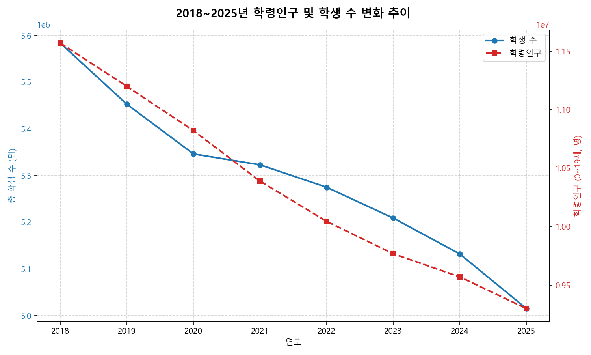
<그림 1> 2018~2025년 학령인구 및 학생 수 변화 추이

#### **4. 기대효과**
* **데이터 기반의 객관적 교육 행정 지원**: 단순 학생 수 기준의 획일적 평가를 보완하여 지역 인구 추세와 공간적 고립도를 동시 고려한 입체적 진단 제공.
* **행정 의사결정 지원**: 2026~2030년 미래 시나리오 시뮬레이션을 통해 통학 버스 지원, 공동 교육과정 운영, 학생수 감소압력 기반 우선점검 참고 지표 대상 지정 등 선제적 자원 배정 검토 가능.
* **이해관계자 소통 강화**: 직관적인 웹 대시보드 시각화 지도를 활용하여 교육 행정 담당자와 지역 주민, 학부모 간 투명한 의사소통 지원.

---

## 3. 【서식 3】 연구 결과보고서

## 1. 기술개발의 목적 및 필요성

### 가. 기술개발의 목적
본 연구개발의 목적은 급격한 학령인구 감소 상황에서 국가 교육 인프라의 약화를 막고, 교육청 및 교육 행정 기관이 데이터에 기반하여 합리적이고 선제적인 의사결정을 내릴 수 있도록 돕는 **"학령인구·학생수 감소압력 예측 및 우선점검 시나리오 분석 시스템"**을 구축하는 것이다. 본 프로젝트는 특정 학교를 행정적으로 결정하는 시스템이 아니라, 학생 수 감소압력과 지리적 고립도를 함께 제시하는 우선점검 참고 도구이다.

본 연구는 단순히 특정 학교의 이진 분류(Binary Classification) 방식에서 탈피하여 다음과 같은 구체적인 목적을 가진다.
1. **정량적 감소압력(Decline Pressure)의 예측**: 
   학교별 과거 학생 수 추이, 학년 및 학급의 구조적 균형도, 지역 인구 변동 지표를 학습하여 향후 5개년(2026~2030년) 동안의 학교별 학생 수 변동 폭을 정량적으로 추정한다.
2. **지리적 공간 고립도 기반 교육공백 우려도 진단**: 
   학교의 경위도 좌표 데이터를 기반으로 구면거리 계산이 가능한 공간 인덱스(BallTree haversine)를 구축하여, 반경 내 동일급 학교 수와 최단 거리를 계량화한다. 이를 학생 수 감소압력과 융합하여, 학생 수 감소 시 대체 교육기관 부재로 인해 심각한 교육서비스 단절(교육공백)이 우려되는 학교군을 선별한다.
3. **설명 가능하고 신뢰할 수 있는 피처 실험 체계 구축**: 
   피처 엔지니어링 영역을 모델링과 독립된 마스터 데이터셋 구축 단계로 분리하고, R0(기존 유지)부터 R5(실제 코호트 반영)까지의 피처 집합을 엄격히 비교·평가하여 기계학습 모델의 성능 향상 요인을 추적한다.
4. **실무 지향형 웹 기반 대시보드 패키지 연동**: 
   최종 도출된 2026~2030년 학교별 예측 시나리오와 우려 신호를 경량화된 JSON 및 CSV 데이터 패키지로 가공하여, 웹 대시보드 지도 상에서 비전문가도 직관적으로 확인하고 시뮬레이션할 수 있도록 지원한다.

---

### 나. 기술개발의 필요성
1. **초저출산 현상에 따른 지방 소멸 및 교육 인프라 위기**: 
   대한민국의 합계출산율은 세계 최저 수준으로 떨어졌으며, 이는 초·중·고 학령인구의 즉각적인 감소로 이어진다. 특히 비수도권 농산어촌뿐 아니라 대도시 내 원도심에서도 저학생수 학교가 급증하고 있으며, 학교의 소멸은 지역 사회의 인구 유출을 가속화시키는 고리가 된다. 이에 따라 선제적이고 객관적인 정량 진단 체계가 시급히 요구된다.
2. **기존 학생 수 중심 단순 정량 지표의 한계**: 
   기존 학생 수 중심의 정량 기준은 현재 학생 수 규모를 빠르게 파악하는 데 유용하지만, 학교의 지리적 고립성이나 주변 동일급 학교 접근성 등 공간적 맥락을 반영하지 못하는 한계가 있다.
3. **학생수 예측 모델링의 구조적 한계와 극복**: 
   과거 기계학습을 활용한 예측 시도는 학습 데이터 내에서 학교 변동 이벤트 자체가 극히 드물고(희소 사건), 행정적 합의나 주민 설득 여부 등 데이터로 기록하기 힘든 비정량적 외생 변수가 개입되어 예측의 정밀도가 극히 떨어졌다. 이를 무리하게 예측할 경우 모델이 과적합되거나 잘못된 정책 신호를 줄 위험이 있다. 이에 따라 예측의 타겟을 특정 이벤트 분류가 아닌 **'학생 수 감소압력'이라는 연속형 수치**로 정의하고 교육공백 우려 지수를 함께 제시하는 방향으로 전환할 필요가 절실하다.
   
전국적인 학생 감소 실태와 대도시 및 비수도권의 공간적 편차를 확인하기 위해 시도별 학생 수 절대 감소량과 상대 감소율을 분석한 결과는 [그림 2]와 [그림 3]에 나타나 있습니다.

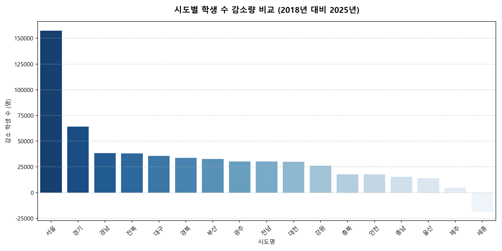
<그림 2> 시도별 학생 수 감소량 비교 (2018년 대비 2025년)

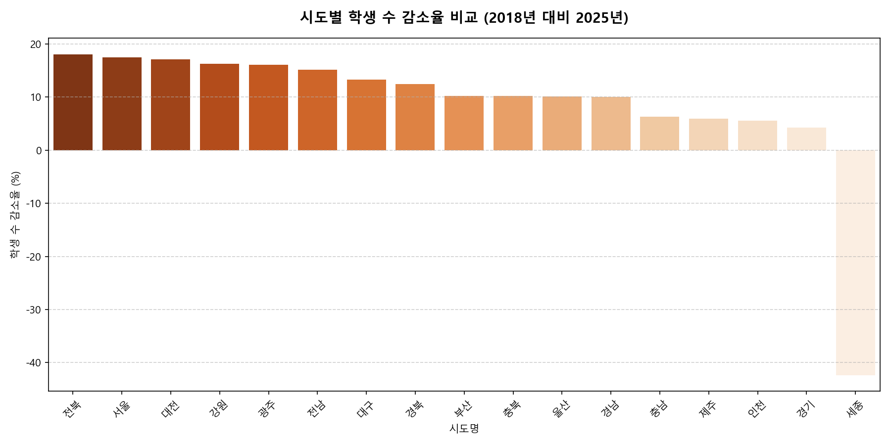
<그림 3> 시도별 학생 수 감소율 비교 (2018년 대비 2025년)

---

## 2. 기술개발의 내용 및 방법

### 가. 기술개발의 내용
본 연구에서는 전국 초·중·고등학교를 대상으로 2012년부터 2025년까지의 과거 이력을 패널 데이터로 구축하였으며, 이 중 2025년은 최종 기준연도(Baseline) 및 시나리오 시작 시점으로 활용하여 2026~2030년의 학생 수 및 감소압력을 예측하는 파이프라인을 설계하였다.

#### 1. 데이터 수집 및 검증 설계
본 프로젝트에서 수집하여 정제·통합한 원천 데이터 구성은 표 1과 같다.

<표 1> 데이터 수집 및 원천 구성표

| 데이터 원천명 | 주요 항목 및 변수명 | 분석 활용 목적 | 데이터 기간 및 범위 | 출처 및 제공처 |
| :--- | :--- | :--- | :--- | :--- |
| **학교알리미 학교 기본 정보** | 학교명, 학교급, 설립 구분, 주소, 행정구역 태그(SGG, 시도) | 학교 개체 식별 및 기본 정보 분석 | 2012년 ~ 2025년, 전국 초·중·고 | 한국교육학술정보원 (KERIS) |
| **학교알리미 학급/학년별 학생 수** | 학년별 학생 수, 학급 수, 교원 수, 교원당 학생 수, 학급당 학생 수 | 타겟 변수(`student_delta_1yr`) 및 과거 Lag 시퀀스 구축 | 2012년 ~ 2025년, 전국 초·중·고 | 한국교육학술정보원 (KERIS) |
| **학교 주소 지오코딩 API** | 위도, 경도 좌표 정보 | 지리적 고립도 연산 및 대시보드 지도 시각화 | 최신 기준(frozen), 전국 학교 | Kakao Address API |
| **KOSIS 국가통계포털** | 시군구(SGG) 단위 합계출산율, 연간 출생아 수, 순인구이동수 | 지역별 거시적 인구 감소 변동 압력 피처 활용 | 2012년 ~ 2025년, 전국 지자체 | 통계청 (KOSIS) |
| **운영 종료 및 변동 이력 데이터** | 운영 종료/신설 여부, 운영 종료 연도, 특수 이벤트 플래그 | 이상치 분리 및 안정 예측 대상 학교 필터링 | 2012년 ~ 2025년, 전국 학교 | 각 지역 시도 교육청 고시자료 |

**[데이터 정제 및 아노말리 처리]**
학습 모델이 비정상적인 신설, 즉각적 변동, 또는 주소 오류에 오염되는 것을 막기 위해 전체 데이터셋에서 2,173개의 학교를 이벤트성 학교로 별도 분리하여 관리하였다. 세부 통계는 표 2와 같다.

<표 2> 이벤트성 학교 분리 및 이상치 처리 전국 요약표

| 구분 | 분리 학교 수 (개) | 유효 좌표 학교 (개) | 무효 좌표 학교 (개) | 2025년 기준 평균 학생 수 (명) | 주원인 및 처리 방식 |
| :--- | :---: | :---: | :---: | :---: | :--- |
| **전국 총계** | 2,173 | 1,609 | 564 | 549.23 | 예측 변동성이 커 별도 레이어로 격리 후 최종 총량에만 병합 |
| **초등학교** | 1,307 | 962 | 345 | 561.31 | 분교장, 신설·이전·통합 등 급격한 증감 이벤트 포함 |
| **중학교** | 515 | 369 | 146 | 495.13 | 학교 이전 재배치 및 구역 조정 대상 |
| **고등학교** | 351 | 278 | 73 | 583.58 | 특수 목적 및 계열 전환에 따른 일시적 학생 수 급변 |
| **운영 종료 완료군** | 562 | 50 | 512 | 0.00 | 2024년 이전 공식 운영 종료된 개체로 학습 대상에서 완전 제거 |
| **기타 이상치** | 1,611 | 1,559 | 52 | 740.75 | 신설 직후 급증, 오류 주소, 학생수 데이터 결측 등 |

분리 처리된 2,173개교에 대해 구체적인 사유별 학교 수 비율 분포는 [그림 4]에 시각화되어 있습니다.

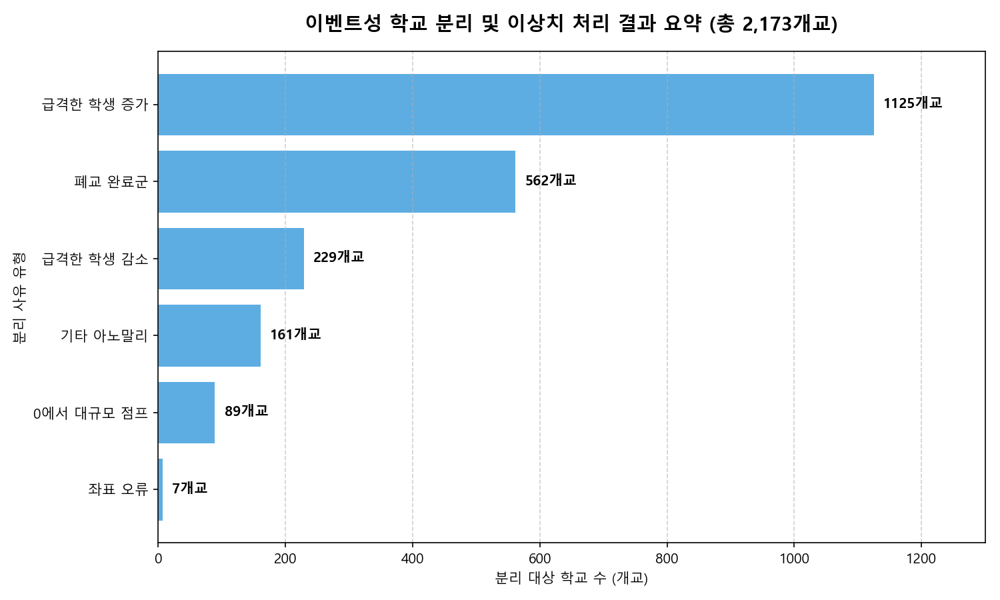
<그림 4> 이벤트성 학교 분리 결과 요약 (총 2,173개교)

---

### 나. 기술개발의 연구 방법
본 기술개발의 전체 연구 절차는 다음과 같이 5단계 순환 흐름으로 수행되었다.
1. **문제의 재정의**: 분류 기반의 한계를 극복하기 위해 다년도 미래 시나리오(Multi-output Regression) 체계로 전환.
2. **다차원 파생 변수 엔지니어링**: R-stage 모델 독립적 피처 마스터셋 설계.
3. **시간 순서 기반 검증 및 누수 방지**: 원천 데이터 수집 범위는 2012~2025년이며, 모델 학습과 검증에는 시계열 순서를 고려한 구간 분할을 적용하고, 2025년은 최종 시나리오 생성의 기준연도로 활용하였다.
4. **모델 Sweeping 및 하이퍼파라미터 튜닝**: Ridge, RandomForestRegressor, HistGradientBoostingRegressor의 20개 후보 탐색.
5. **웹 대시보드 데이터 배포 패키지 구축**: 사용 환경에 적합한 JSON 스키마로 시나리오 내보내기.

전체적인 데이터 흐름과 단계별 정제 및 학습의 구조는 [그림 5]와 같습니다.

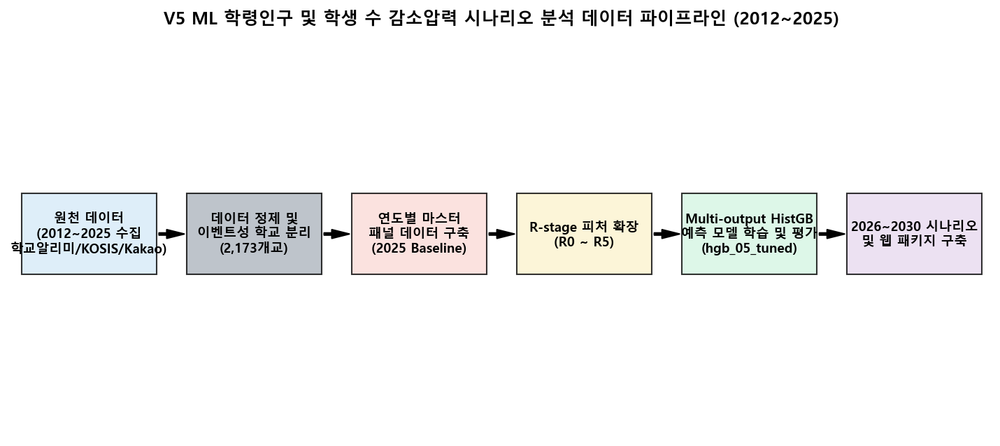
<그림 5> V5 ML 학령인구 및 학생 수 감소압력 시나리오 분석 데이터 파이프라인 (2012~2025)

#### 1. 다차원 파생 변수 엔지니어링 (R-stage 피처 그룹)
피처 엔지니어링 단계는 R-stage의 선행 단계로 수행되어 마스터 데이터셋에 통합 저장되었다. 모델 학습 시에는 특정 피처 그룹만 활성화되도록 설계되었습니다. 단계별 구조는 [그림 6]과 같습니다.

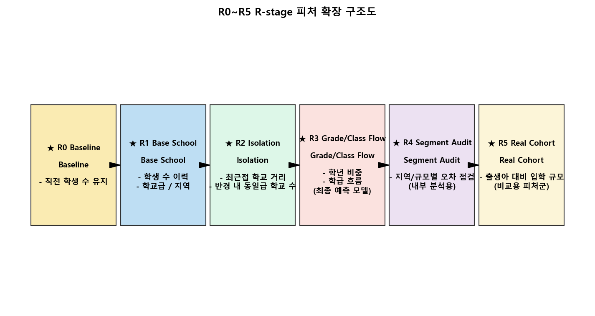
<그림 6> R0~R5 R-stage 피처 확장 구조도

단계별 피처 그룹의 상세 정의 및 포함된 세부 변수명은 표 3과 같다.

<표 3> R-stage별 구성 피처 그룹 정의

| R-stage 단계 | 피처 그룹명 (한글/영문) | 핵심 활용 변수명 | 피처 그룹 설명 및 유효성 판단 기준 |
| :---: | :--- | :--- | :--- |
| **R0** | **이전 값 기준선** (Baseline) | `student_count_lag_1` | 기계학습 알고리즘을 사용하지 않고 현재 학생 수가 그대로 유지되거나 직전 1년 변동폭이 지속된다고 가정하는 기준선 모델. |
| **R1** | **기본 학교 속성 및 이력** (Base School Features) | `student_count_lag_1` ~ `5`, `student_delta_lag_1` ~ `3`, `sido_code`, `sgg_code`, `school_level` | 학교 자체의 과거 학생수 이력 시퀀스와 행정구역 코드만 사용하여 기본적인 학교 단위의 시계열 패턴 학습. |
| **R2** | **지리적 고립도 지표** (Isolation Features) | `nearest_same_level_distance_km`, `same_level_school_count_within_5km`, `isolation_score` | 공간 탐색 인덱스를 사용하여 계산된 가장 가까운 동일급 학교까지의 거리 및 반경 5km 내의 동일급 학교 수. 교육 서비스 접근 취약성 판단 목적. |
| **R3** | **학년/학급별 흐름 구조** (Grade/Class Flow) | `grade_share_1` ~ `6`, `class_count`, `grade_imbalance_ratio`, `entrants_total`, `graduates_total` | 학년별 학생 수 비중(예: 저학년과 고학년의 비율 불균형), 학급 수 변동성 등 학교 내부의 구조적 학생 유입/유출 지표 반영. (최종 모델 적용) |
| **R4** | **세그먼트 성능 진단** (Segment Performance Audit) | `segment_capital_area`, `segment_small_school` *(코드상 내부 성능 분석 변수)* | 지역 및 학교 규모에 따라 예측 오차가 특정 구간에 편향되는지 확인하기 위한 성능 감사 단계입니다. 특정 학생 수 이하 학교를 분석 대상으로 표시하기 위한 기준이 아니라, 모델의 오차와 안정성을 점검하기 위한 내부 분석용 세그먼트입니다. (최종 시나리오 판정에 직접 사용하지 않음) |
| **R5** | **실제 코호트 연계** (Real Cohort Feature) | `sgg_actual_cohort_ratio_lag7` *(기존 코드명 R6)* | 현재 초등학교 1학년 학생수와 7년 전 해당 SGG 지역의 실제 KOSIS 출생아 수의 비율을 계산하여 입학 압력을 측정하는 변수. (비교 검토용 분석 피처군) |

---

## 3. 기술개발의 연구결과

### 가. 모델 탐색 및 하이퍼파라미터 튜닝 결과
본 연구에서는 R3(학년/학급 흐름 포함) 및 R5(실제 코호트 포함) 단계를 대상으로 Ridge, RandomForestRegressor, HistGradientBoostingRegressor 계열의 총 20개 매개변수 조합을 학습시킨 후, 1~5년 전체 예측 Horizon에서의 평균 MAE와 Delta R² 지표를 비교하였다. 비교 결과는 표 4와 같다.

<표 4> R3/R5 RF 및 HistGB 제한 후보 비교 (Top 3 성능 요약)

| 순위 | 실험 단계 | 모델 알고리즘 | 파라미터 셋 명칭 | 1~5년 평균 MAE | 1~5년 평균 Delta R² | 1~5년 평균 P95 Absolute Error | 주요 하이퍼파라미터 설정 값 |
| :---: | :---: | :--- | :--- | :---: | :---: | :---: | :--- |
| **1** | **R3** | **HistGradientBoosting** | **hgb_05_deeper_regularized** | **34.380397** | **0.443568** | **110.765199** | **max_iter=120, max_leaf_nodes=31, learning_rate=0.04, l2_regularization=0.1** |
| **2** | **R3** | **HistGradientBoosting** | **hgb_03_balanced** | 34.394548 | 0.443166 | 111.043052 | max_iter=80, max_leaf_nodes=31, learning_rate=0.06, l2_regularization=0.05 |
| **3** | **R3** | **HistGradientBoosting** | **hgb_04_fast_wider** | 34.696062 | 0.435482 | 111.720703 | max_iter=50, max_leaf_nodes=31, learning_rate=0.08, l2_regularization=0.01 |

**[모델 선정 및 유효성 분석]**
1. **R3가 R5보다 우수한 성능 발휘**: 
   지역 출생아 수와 7년 시차를 결합한 R5 actual cohort 모델(평균 MAE 약 39.91명)은 지역 간 인구 이동성(Migration Noise)과 신도시 개발에 따른 입학 학군 왜곡 현상으로 인해 오차가 크게 나타났다. 반면, 학교 내부의 학년별 흐름과 졸업-입학 균형을 직접 포착하는 R3 단계 피처 기반 모델이 더 안정적인 예측 성능을 보였음이 실증되었다.
2. **HistGradientBoostingRegressor의 예측력**: 
   Ridge 선형 모델은 대규모 데이터의 비선형 감소 경향을 반영하지 못했고, RandomForestRegressor(평균 MAE 37.86명, Delta R² 0.334)는 예측 시나리오가 안정적이나 다소 보수적으로 수렴하였다. 반면, 적절한 정규화(L2=0.1)와 깊은 잎(leaf_nodes=31) 설정을 가진 HistGradientBoostingRegressor 모델은 1~5년 평균 MAE를 **34.38명**으로 낮추고 변화량 설명력(Delta R²)을 **0.4436**으로 개선하여 최종 예측 모델로 선정되었다.

전체 소스코드 파일 및 파이프라인의 연계 관계는 [그림 7]에 표시되어 있습니다.

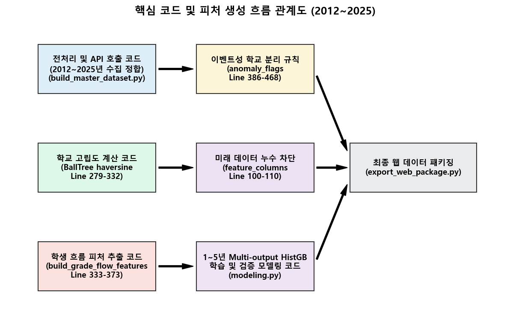
<그림 7> 핵심 코드 및 피처 생성 흐름 관계도 (2012~2025)

---

### 나. 최종 선정 모델의 예측 기간(Horizon)별 성능
최종 선정된 `R3 기반 1~5년 Multi-output HistGradientBoostingRegressor 튜닝 모델` (파라미터 셋 `hgb_05_deeper_regularized`)의 1년부터 5년까지의 연도별 예측 검증 지표는 표 5와 같다.

<표 5> 최종 선택 모델의 예측 기간(Horizon)별 성능 지표

| 예측 Horizon | 예측 대상 연도 | MAE (명) | RMSE (명) | Level R² | Delta R² | Median AE (명) | 저학생수 학교 MAE (명) |
| :---: | :---: | :---: | :---: | :---: | :---: | :---: | :---: |
| **1년 예측** | 2026년 | 14.038 | 21.594 | 0.9952 | 0.4733 | 8.629 | 3.780 |
| **2년 예측** | 2027년 | 25.675 | 38.897 | 0.9844 | 0.4254 | 15.557 | 5.841 |
| **3년 예측** | 2028년 | 36.018 | 54.091 | 0.9699 | 0.4088 | 22.161 | 7.463 |
| **4년 예측** | 2029년 | 43.922 | 65.830 | 0.9553 | 0.4408 | 26.825 | 8.395 |
| **5년 예측** | 2030년 | 52.248 | 77.993 | 0.9371 | 0.4695 | 32.033 | 9.244 |

**[모델 평가 지표의 정의 및 성능 해석]**
본 프로젝트의 시공간 다차원 모델 평가에 활용된 6가지 성능지표에 대한 정의 및 해석 지침은 다음과 같다.

1. **MAE (Mean Absolute Error, 명)**:
   * 예측값과 실제값의 절대 오차들의 평균으로, 실제 학생 수 기준으로 모델이 평균 몇 명 정도의 오차로 예측하고 있는지를 가장 직관적으로 보여주는 척도이다. 값이 낮을수록 예측의 정확성이 우수하다.
2. **RMSE (Root Mean Squared Error, 명)**:
   * 예측 오차들의 제곱합 평균에 루트를 씌운 값으로, 큰 예측 오차(실패 케이스)에 대해 더 큰 패널티를 부여한다. 따라서 일부 특정 학교에서 심각한 예측 실패가 존재했는지를 식별하고 통제하는 데 유리하다. 값이 낮을수록 안정적이다.
3. **Level R² (결정계수 - 학생수 수준)**:
   * 실제 학생 수 절대 규모 자체를 모델이 얼마나 정밀하게 설명하고 있는지를 나타내는 지표이다. 학교 규모(대형교, 소형교 등)의 차이를 모델이 전반적으로 얼마나 잘 설명하는지 보여주며, 1에 가까울수록 설명력이 높다.
4. **Delta R² (결정계수 - 학생수 변화량)**:
   * 학생 수의 절대 규모가 아닌, 연도 간의 '변화량(증감 흐름)'을 모델이 얼마나 잘 설명하는지 측정하는 핵심 지표이다. 본 연구와 같이 지방 소멸 및 학생 감소 추세의 흐름 자체를 포착하는 데 가장 중요한 척도이며, 1에 가까울수록 우수하다.
5. **Median AE (Median Absolute Error, 명)**:
   * 절대 오차들의 중앙값으로, 소수의 극단적인 이상치(예: 돌연 학생수 급변 사례)에 왜곡되지 않는 전형적인 일반 학교에서의 보편적인 오차 수준을 대변한다. 값이 낮을수록 실무적 신뢰도가 높다.
6. **저학생수 학교 MAE (명)**:
   * 전교생 수가 적은 취약 구간의 학교 집단에 한정한 절대 오차 평균이다. 교육공백 우려가 높은 저학생수 학교군에서 모델의 예측 오차가 편향 없이 안정적으로 통제되고 있는지를 검증하는 보조 지표로 활용되며, 값이 낮을수록 안정적이다.

**[종합 성능 해석]**
* **예측 기간에 따른 오차 누적**: 예측 Horizon이 1년(2026년)에서 5년(2030년)으로 늘어날수록 MAE는 14.04명에서 52.25명으로 증가한다. 이는 미래 시점의 정보 부족에 따른 자연스러운 현상이며, 다출력 HistGradientBoosting의 점진적 변화량 누적 제어를 통해 안정적으로 관리되고 있다.
* **Level R²와 Delta R²의 차이**: Level R²는 0.93 이상의 극도로 높은 값을 유지하여 전체 학교의 학생 수 규모를 매우 높은 수준으로 설명한다. 반면, 변화량 자체를 의미하는 Delta R²는 0.40~0.47 대를 기록하여 난도가 높은 증감 흐름 변화의 40% 이상을 기계학습 모델이 성공적으로 설명하고 있음을 뒷받침한다.
* **저학생수 학교의 강건성**: 5년 예측 기준 저학생수 학교의 MAE는 9.24명으로, 대형 학교를 포함한 전체 평균 MAE(52.25명) 대비 매우 낮게 통제된다. 이는 해당 학교군을 대상으로 하는 교육 서비스 및 교통 자원 배치 등 행정 계획 시 모델이 실질적인 보조 도구로 유용하게 기능할 수 있음을 입증한다.

예측 기간별 MAE 오차의 완만한 누적 통제 패턴과 Delta R² 설명력 추이는 [그림 8]에 그래프로 나타나 있습니다.

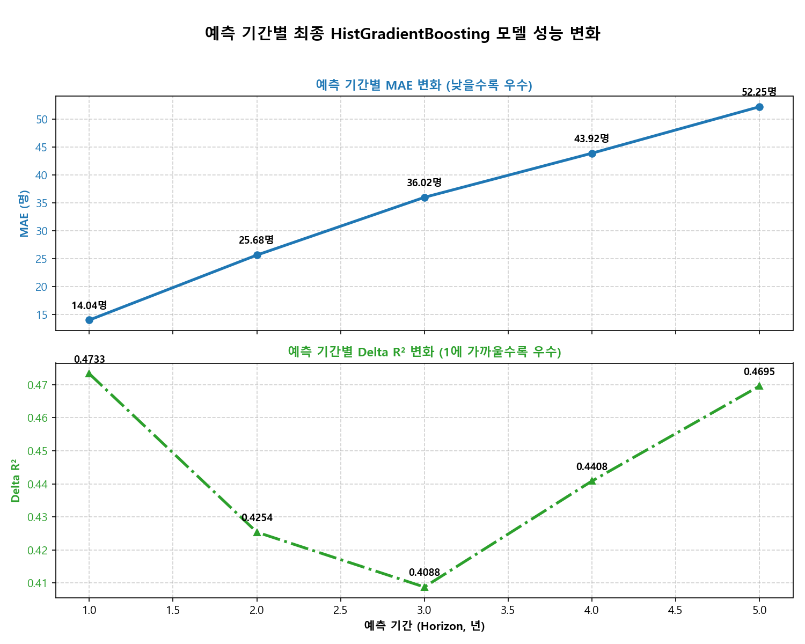
<그림 8> 예측 기간별 최종 HistGB 모델 성능 변화

---

### 다. 2026~2030년 시나리오 분석 결과
본 프로젝트는 특정 학교를 행정적으로 결정하는 시스템이 아니라, 학생 수 감소압력과 지리적 고립도를 함께 제시하는 우선점검 참고 도구이다. 최종 모델을 활용하여 2025년을 Baseline으로 2030년까지 예측한 전국 단위 학생 수 및 관련 지표 요약은 표 6 및 표 7과 같다. (안정 예측 대상 학교 기준)

<표 6> 2025~2030년 전국 예측 학생 수 및 기본 추이

| 연도 | 학교 수 (개) | 유효 좌표 학교 (개) | 예측 총 학생 수 (명) | 학교당 평균 학생 수 (명) | 저학생수 학교 수 (개) | 2025년 대비 누적 감소율 |
| :---: | :---: | :---: | :---: | :---: | :---: | :---: |
| **2025** | 10,454 | 10,453 | 3,837,653.00 | 367.10 | 2,315 | 0.00% |
| **2026** | 10,454 | 10,453 | 3,720,709.42 | 355.91 | 2,343 | -3.05% |
| **2027** | 10,454 | 10,453 | 3,613,086.25 | 345.62 | 2,393 | -5.85% |
| **2028** | 10,454 | 10,453 | 3,503,336.86 | 335.12 | 2,434 | -8.71% |
| **2029** | 10,454 | 10,453 | 3,400,959.49 | 325.33 | 2,481 | -11.38% |
| **2030** | 10,454 | 10,453 | **3,299,224.39** | **315.59** | **2,539** | **-14.03%** |

*참고: 위 통계는 안정 예측 대상 학교 패널 기준이며, 이벤트성 분리 대상 2,173개교의 2025년 평균 학생 수 기준 총 학생 수 분량은 약 119.3만 명이다.*

<표 7> 2030년 최종 시점 기준 감소압력 및 교육공백 우려 지표

| 지표 항목 | 전국 요약 수치 (개교/만 명) | 지표 정의 및 목적 |
| :--- | :---: | :--- |
| **감소압력 관측 학교 수** | 5,425개교 | 2025년 대비 2030년 학생 수 감소 경향이 지속 관측되는 학교 |
| **고립도 높은 저학생수 학교 수** | 1,462개교 | 학생수 취약 구간(저학생수)이면서 반경 5km 내 대체 학교가 매우 드문 고립 학교 |
| **교육공백 우려 학교 수** | 1,848개교 | 지리적 고립성과 급격한 학생 수 감소압력이 결합되어 통학 및 교육 접근성 훼손이 우려되는 학교 |
| **이벤트성 분리 대상 학교 수** | 2,173개교 | 급격한 변동(신설, 즉각적 변동 등) 또는 좌표 이상으로 예측 노이즈가 큰 분리 관리 대상 학교 |
| **이벤트성 분리 대상 총 학생 수 분량** | 약 119.3만 명 | 이벤트성 분리 대상 학교들의 2025년 평균 학생 수 기준 전국 합산 규모 |

*감소압력 관측 학교 수, 고립도 높은 저학생수 학교 수, 교육공백 우려 학교 수는 2030년 최종 시점 기준으로 산출한 요약 지표이다.*

**[기존 권고 기준 설명 표현 최종 정밀화]**
본 프로젝트는 특정 학교를 행정적으로 결정하는 시스템이 아니라, 학생 수 감소압력과 지리적 고립도를 함께 제시하는 우선점검 참고 도구이다. 다만 웹 대시보드에서는 과거 교육부의 적정규모학교 육성 및 분교장 개편 권고기준에서 제시되었던 학생 수 구간을 참고하여, 학생 수가 해당 참고 기준 이하로 내려가는 학교를 “우선점검 참고 표시”로 시각화한다. 이 표시는 행정적 확정 판정이 아니라, 학생 수 감소압력과 지리적 고립도를 함께 검토하기 위한 참고 레이어이다. 또한 최신 정책 방향에서는 일률적인 국가 단위 권고 기준보다 시도교육청이 지역 여건과 교육 여건을 반영하여 자체 기준과 절차를 마련하는 방향이 강조되고 있으므로, 본 프로젝트의 기준표는 실제 행정 결정 기준이 아니라 웹 시각화를 위한 내부 참고 기준으로만 활용된다.

<표 8> 기존 적정규모학교 권고 학생수 참고 기준 및 웹 표시 방식

| 지역 구분 | 학교급 | 권고 학생수 기준 | 웹 표시 의미 |
| :--- | :--- | :---: | :--- |
| 면·도서·벽지 지역 | 초·중·고 공통 | 60명 이하 | 참고 기준 이하 학교로 표시 |
| 읍 지역 | 초등학교 | 120명 이하 | 참고 기준 이하 학교로 표시 |
| 읍 지역 | 중·고등학교 | 180명 이하 | 참고 기준 이하 학교로 표시 |
| 도시 지역 | 초등학교 | 240명 이하 | 참고 기준 이하 학교로 표시 |
| 도시 지역 | 중·고등학교 | 300명 이하 | 참고 기준 이하 학교로 표시 |

웹 대시보드는 단순히 학생 수가 낮은 학교를 나열하는 방식이 아니라, 기존 권고 학생수 참고 기준 이하 여부, 2026~2030년 학생 수 감소압력, 주변 동일급 학교 접근성 및 고립도를 함께 표시한다. 따라서 웹에서 강조되는 학교는 행정적 결정의 대상이 아니라, 행정기관이 추가 검토할 수 있는 우선점검 참고 대상이다.

**[시나리오 핵심 발견]**
* **학생 수 감소 가속화**: 2025년 대비 2030년에는 총 학생 수가 **14.03%** 누적 감소할 것으로 예측되어, 개별 학교의 학급 운영난이 급격히 심화될 것이다.
* **저학생수 학교의 급증**: 저학생수 학교가 2025년 2,315개에서 2030년 2,539개로 증가하여, 초밀착 교육 서비스의 필요성이 커진다.
* **교육공백 우려군 탐지**: 2030년 최종 시점 기준 단순 학생 수 감소압력이 관측되는 학교(5,425개) 중, 주변에 대체 학교가 없어 학생 수 감소 시 교육 서비스 고립이 우려되는 '교육공백 우려 학교'가 1,848개교에 달함을 시각적으로 참고 표시하였다. 이는 교육청이 통학 지원, 공동 교육과정 운영, 분교장 개편 가능성 등을 검토할 때 참고할 수 있는 행정적 우선점검 보조지표로 활용될 수 있다.

2025년부터 2030년까지 안정 예측 대상 학교의 전국 예측 학생 수 감소 추이는 [그림 9]와 같습니다.

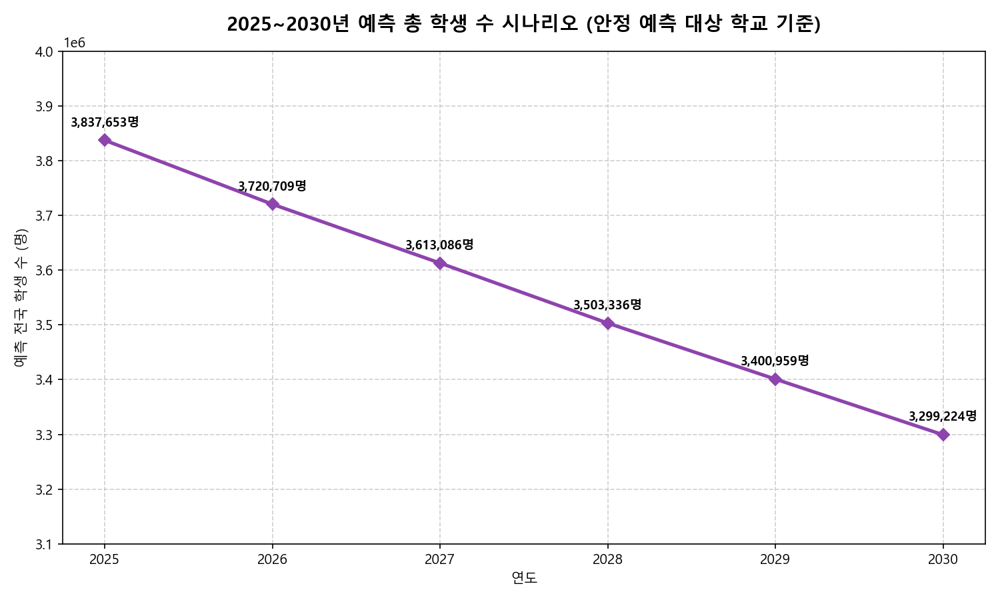
<그림 9> 2025~2030년 예측 총 학생 수 시나리오 (안정 예측 대상 학교 기준)

---

### 라. 웹 대시보드용 데이터 패키지 구축 및 대시보드 시각화
예측 엔진의 결과를 실무 행정 시스템과 연동하기 위해 JSON/CSV 패키지를 `public/data/scenario_v5_final/` 및 `public/data/scenario_v5_v2/` 하위에 내보냈다.
* `final_scenario_school_web.json`: 안정 예측 대상 학교의 경위도, 연도별 예측 학생수, 감소압력 등급 포함.
* `excluded_school_web.json`: 특수 이벤트성 분리 학교 리스트.
* `summary_national_by_year.csv`: 전국 연도별 집계 요약.

구축된 웹 대시보드는 전국 요약, 학교 단위 지도, 지역 단위 분석 화면으로 구성된다. 전국 요약 화면은 예측 총량과 핵심 지표를 빠르게 파악하기 위한 대시보드이며, 학교 단위 지도 화면은 개별 학교의 위치·감소압력·고립도·우선점검 참고 여부를 확인하기 위한 핵심 화면이다. 지역 분석 화면은 시도 또는 지역 단위의 학생 수 변화와 우려 신호 분포를 요약하여 지역 간 차이를 비교할 수 있도록 구성하였다.

웹 대시보드는 왼쪽 사이드바를 통해 전국 요약, 학교 위치 지도, 지역 분석, 학교별 상세 조회, 모델 검증, 분석 방법 화면으로 이동할 수 있도록 구성하였다. 지도 화면에서는 연도, 시도, 학교급, 학생수 기준, 교육공백 우려 여부 등의 필터를 적용할 수 있으며, 각 학교는 지도 위의 마커로 표시된다. 마커는 학생 수 감소압력, 기존 권고 학생수 참고 기준 이하 여부, 고립도 정보를 함께 반영하여 우선점검 필요성이 높은 학교를 직관적으로 구분할 수 있도록 설계하였다.

학교 단위 지도 화면에서 특정 마커를 선택하면 오른쪽 상세 패널에 해당 학교의 예측 학생 수, 감소율, 주변 동일급 학교 접근성, 최근접 학교 거리, 고립도 지표, 우선점검 참고 표시 여부가 표시된다. 이를 통해 사용자는 단순히 학생 수가 적은 학교를 확인하는 것이 아니라, 해당 학교가 주변 교육 인프라와 공간적 관계를 갖는지 함께 확인할 수 있다.

지역 분석 화면은 시도 또는 지역 단위로 2025~2030년 학생 수 변화 추이와 감소율, 감소압력 상위 학교, 지역 내 우려 등급 분포를 요약한다. 따라서 교육청이나 지자체는 개별 학교 단위의 지도 분석과 지역 단위의 총량 분석을 함께 확인하여 행정 검토 우선순위를 비교할 수 있다.

단, 웹 화면에서 강조되는 학교는 행정적 결정 대상이 아니라 우선점검 참고 대상이다. 웹 지도는 학생 수 감소압력과 공간적 고립도, 기존 권고 학생수 참고 기준 이하 여부를 함께 시각화하여 추가 검토가 필요한 학교를 탐색하도록 돕는 보조 도구로 설계되었다.

구축된 웹 대시보드의 주요 화면은 [그림 10], [그림 11], [그림 12]와 같다. [그림 10]은 전국 단위 요약 지표와 예측 추이를 보여주는 전체 요약 화면이며, [그림 11]은 학교별 위치 마커와 선택 학교 상세 패널을 통해 감소압력과 고립도 정보를 확인하는 지도 화면이다. [그림 12]는 시도 또는 지역 단위의 학생 수 변화와 우려 신호 분포를 요약하는 지역 분석 화면이다.

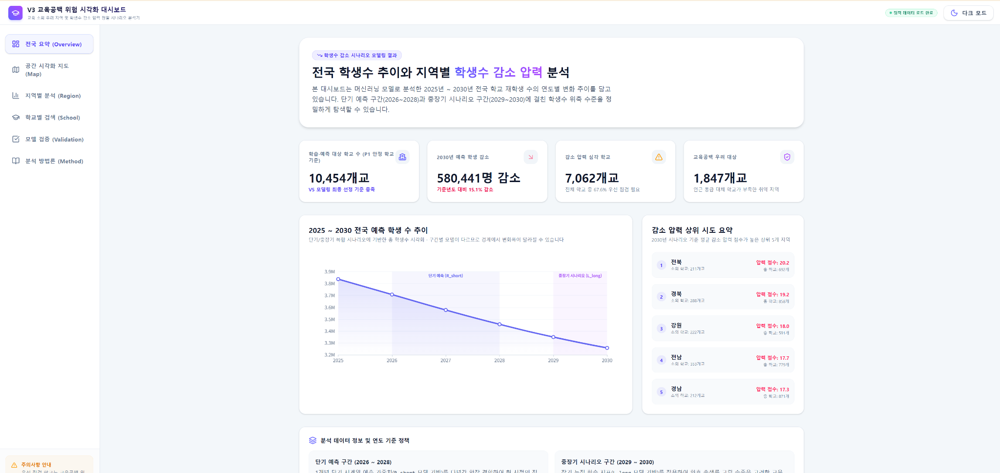
<그림 10> 웹 대시보드 전체 요약 화면

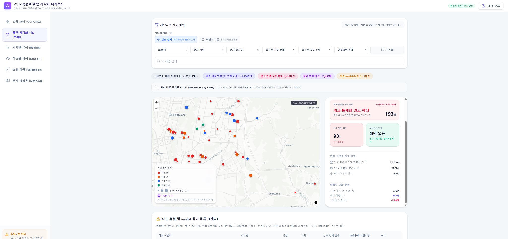
<그림 11> 학교 단위 지도 및 상세 진단 화면

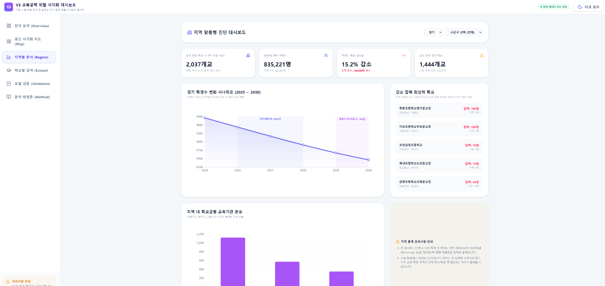
<그림 12> 지역 단위 요약 및 시나리오 분석 화면

---

## 4. 기술개발의 활용방안 및 기대효과

### 가. 기술개발의 활용방안
1. **지자체 및 교육청의 학교 우선점검 보조도구**: 
   단순 학생 수 미달 학교 목록이 아닌, 감소압력 점수와 교육공백 우려 점수를 교차한 지도를 기반으로 점검 우선순위를 도출한다.
2. **맞춤형 통학 및 복지 자원 배분 시뮬레이션**: 
   고립 지표가 높고 급격한 학생 감소가 예상되는 학교군을 중심으로 통학 셔틀버스 노선 증설, 에듀버스 자원 배정, 공동 교육과정 운영 등을 검토할 때 참고자료로 활용할 수 있다.
3. **거시적 교육 인프라 재배치 수립 참고**: 
   2026~2030년 시군구 단위의 학령인구 변동 요약을 기반으로 신도심 학교 신설 규모 및 원도심 학교 통합 학군 운영 규모를 선제적으로 검토할 수 있다.
4. **민관합동 지역 소멸 대응 의사소통 자료**: 
   대시보드 지도를 주민 공청회 등에 개방하여 학교 규모 조정 및 공동학군 논의 시 발생할 수 있는 소통 지체를 데이터 기반의 객관적 시각자료로 해결한다.

---

### 나. 기술개발의 기대효과
1. **데이터 기반 선제적 교육 행정 체계로의 패러다임 시프트**: 
   행정가가 과거 경험이나 사후 통계에 의존하던 수동적 의사결정에서 벗어나, 미래 시나리오를 바탕으로 예방 행정을 수행할 수 있도록 지원한다.
2. **다차원 공간 인구 구조 분석을 통한 지역 소멸 대응성 제고**: 
   학교별 접근성(최단 거리, 5km 반경 분포)을 수치적으로 모델에 편입함으로써, 교육공백 우려를 사전에 완화하여 교육 접근성 보완 근거를 구축한다.
3. **이해관계자 신뢰성 및 투명성 증대**: 
   기계학습 모델의 피처 중요도(R3 학년 흐름의 지배적 효과)와 교차 검증 수치를 명확히 제시하여, 우선점검 지표의 객관성과 대국민 투명성을 동시에 확보한다.
4. **실무 융합형 인재 양성 및 개발자 역량 내재화**: 
   공공 Open API 데이터 가공, 공간 인덱싱 알고리즘 설계, 앙상블 회귀 예측, 경량 데이터 패키징, 반응형 지리 정보 웹 개발에 이르기까지 풀스택 데이터 사이언스 개발 생태계를 실무적으로 내재화하고 인재를 양성한다.

---

## 5. 참여 연구원 현황

### 가. 연구 책임자
* **소속 및 성명**: [작성 필요] (대학명 / 지도교수 성명)
* **직급**: [작성 필요] (예: 교수)
* **역할**: 프로젝트 총괄 감독, 연구 방향 지도, 산학 협력 조율.

### 나. 산업체 연구원
* **소속 및 성명**: [작성 필요] (산업체 기업명 / 연구원 성명)
* **직급**: [작성 필요] (예: 수석연구원)
* **역할**: 요구사항 정의, 모델 실무 활용성 평가, 기술 피드백.

### 다/라. 학생 연구원
* **대표학생**: 
  - 성명: [작성 필요] (학번: [작성 필요], 학과: [작성 필요])
  - 역할: 전체 데이터 파이프라인 개발, 모델 설계 및 튜닝, 보고서 작성 주도.
* **공동 연구원**: 
  - 성명: [작성 필요] (학번: [작성 필요], 학과: [작성 필요])
  - 역할: 지리지표 가공, 웹 대시보드 시각화 설계 및 데이터 패키징 구현.
* **GitHub Repository 주소**: [작성 필요]

---

## 6. 오픈소스 활용 현황

### 가. 오픈소스 활용 내용

| AI 관련 프로젝트 | 분류 | 활용한 오픈소스 | 참고 페이지 |
| :--- | :--- | :--- | :--- |
| **학령인구·학생수 감소압력 예측 및 시나리오 분석** | 오픈소스 도구 | Visual Studio Code, Git, GitHub, Python 실행 환경, Jupyter Notebook | 각 도구 공식 문서 및 프로젝트 저장소 |
| **학령인구·학생수 감소압력 예측 및 시나리오 분석** | 오픈소스 라이브러리 | pandas(>=2.0.0), numpy(>=1.24.0), openpyxl(>=3.1.0), scikit-learn(>=1.2.0), joblib(>=1.2.0), optuna(>=4.9.0), matplotlib, seaborn | 각 라이브러리 공식 문서 |
| **학령인구·학생수 감소압력 예측 및 시나리오 분석** | 공개데이터/Open API | KOSIS 국가통계포털(학령인구, 출생아 수, 합계출산율, 인구이동), 학교알리미(학교 기본 정보, 학급별/학년별 학생 수), Kakao Developers API(주소 좌표 변환 API) | KOSIS, 학교알리미, Kakao Developers 공식 문서 |

### 나. Github 프로젝트 정보
* **Github 프로젝트 주소**: [작성 필요]

---

## 7. 참고문헌

1. 통계청, "KOSIS 국가통계포털(인구이동, 출생아 수, 합계출산율, 학령인구 데이터)", https://kosis.kr, 접속일: 2026-06-14.
2. 한국교육학술정보원(KERIS), "학교알리미(학교 기본 정보, 학년별/학급별 학생 수 데이터)", https://www.schoolinfo.go.kr, 접속일: 2026-06-14.
3. 카카오, "Kakao Developers Local API (주소/좌표 변환 API 문서)", https://developers.kakao.com, 접속일: 2026-06-14.
4. 행정안전부, "공공데이터포털", https://www.data.go.kr, 접속일: 2026-06-14.
5. Scikit-Learn Developers, "scikit-learn User Guide (HistGradientBoostingRegressor, RandomForestRegressor, Ridge)", https://scikit-learn.org, 접속일: 2026-06-14.
6. McKinney, W., "Python for Data Analysis", O'Reilly Media, 2012-10-15.
7. 교육부, "소규모학교 혁신을 통한 지역 교육력 제고 방안", 대한민국 정책브리핑/교육부 자료, 2026-06-10, 접속일: 2026-06-14.

